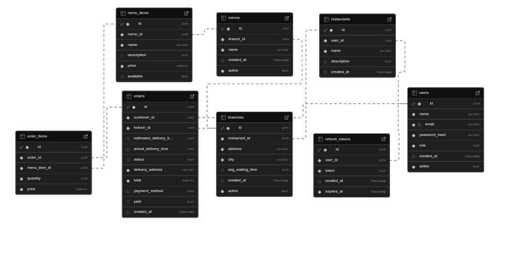

# Couriers Delivery Service

## Overview
**Couriers Delivery Service** is a backend RESTful API designed for a food delivery platform.  
It allows **customers** to place orders from **restaurants branches**, calculates **total price** and **estimated delivery time**, and manages **order status updates** throughout the delivery process.  

The system focuses on:
- Managing **users** (customers, restaurants, and admins).
- Handling **restaurants branches**, their **menus**, and **preparation times**.
- Processing **orders**, updating their status from **pending** to **preparing** to **delivered**, and marking them as **paid** upon delivery (or before).

---

## Core Entities

### 1. **User**
- Represents either a **customer**, **restaurant account**, or **admin**.
- Attributes:
  - `id`
  - `name`
  - `email`
  - `password_hash`
  - `role` (`customer`, `restaurant_owner`, `admin`)
  - `created_at`
  - `active`

### 2. **Restaurant Entities**
- A restaurant account can have many branches (but a branch can only belong to one restaurant), these branches have their own menu and waiting times
##### Restaurant:
- Attributes:
  - `id`
  - `user_id` (owner, FK)
  - `name`
  - `description` (optional)
  - `created_at`

##### Branch:
- Attributes:
  - `id`
  - `restaurant_id` (FK)
  - `address`
  - `city`
  - `avg_waiting_time`
  - `created_at`
  - `active`

### 3. **Menu Entities**

##### Menu
- Represents branch menu, these can be deactivate whenever the branch requires so.
- Attributes:
  - `id`
  - `branch_id` (FK)
  - `name`
  - `crated_at`
  - `active`

##### Menu Item
- Represents a menu item, which can only belong to one menu and its completely independent of it
- Atributes
  - `id`
  - `menu_id` (FK)
  - `name`
  - `description`
  - `price`
  - `available`

### 4. **Order Entities**
##### Order
- Represents a customer order.
- Attributes:
  - `id` (PK)
  - `public_id` (UUID, unique, public identifier)
  - `customer_id` (user id, FK)
  - `branch_id` (FK)
  - `status` (`pending` (default), `preparing`, `on_the_way`, `delivered`, `cancelled`)
  - `payment_method` (`cash` (default), `credit_card`, `debit_card`, `online_payment`)
  - `delivery_address`
  - `estimated_delivery_time`
  - `actual_delivery_time`
  - `total`
  - `paid` (boolean, `true` once delivered)
  - `created_at`
  - plus timestamps for trazability (when was each status set)

##### Order Item
- Represents a item in an order, an item can only belong to one order
- Attributes:
  - `id`
  - `oder_id` (FK)
  - `menu_item_id` (FK)
  - `quantity`
  - `price`

### 5. **DB Diagram**


---

## Order Flow

1. **Customer places an order** (`POST /orders`) selecting restaurant and menu items.
2. **System calculates total price and estimated delivery time** based on restaurant preparation time.
3. **An order id (UUID) is given to track the order**
4. **Restaurant updates status**:
   - `preparing` → when order starts being prepared.
   - `on_the_way` → when delivery leaves the restaurant.
5. **Delivery completion**:
   - Restaurant (or delivery person using restaurant account) sets order to `delivered`.
   - Order is automatically marked as `paid` (if it wasn't marked before).

---

## 📖 API Endpoints

### 👤 Users
- **GET** `/users` 🔒 (admin) → Get all users.  
- **GET** `/users/{id}` 🔒 (admin) → Get a user by ID.  
- **POST** `/users/register` → Register a new user.  
- **POST** `/users/login` → Log in and receive a JWT token.  
- **POST** `/users/refresh-token` → Refresh the access token.  
- **POST** `/users/logout` → Log out the current user.  

---

### 🍽️ Restaurants
- **POST** `/restaurants` 🔒 (admin) → Create a new restaurant.  
- **GET** `/restaurants` 🔒 (admin) → List all restaurants.  
- **GET** `/restaurants/{id}` 🔒 (admin) → Get a restaurant by ID.  
- **PATCH** `/restaurants/{id}` 🔒 (admin) → Update restaurant details.  
- **GET** `/restaurants/{id}/branches` 🔒 (admin) → Get all branches of a restaurant.  

---

### 🏬 Branches
- **POST** `/branch` 🔒 (restaurant_owner) → Create a new branch.  
- **PATCH** `/branch/{id}` 🔒 (restaurant_owner) → Update branch details.  
- **PATCH** `/branch/{id}/active` 🔒 (restaurant_owner) → Activate/deactivate a branch.  

---

### 📋 Menus
- **POST** `/branch/{id}/menu` 🔒 (restaurant_owner) → Create a menu with items.  
- **GET** `/branch/{id}/menu` → List all menus for a branch.  
- **PATCH** `/branch/{id}/menu/{menu_id}` 🔒 (restaurant_owner) → Edit a menu (add/delete items).  
- **PATCH** `/branch/{id}/menu/{menu_id}/active` 🔒 (restaurant_owner) → Activate/deactivate a menu.  

### 🧾 Orders
- **POST** `/order` 🔒 (customer) → Create a new order. 
  - Notes:
    - Optional header `x-idempotency-key` supported to avoid duplicate orders on retries.
    - The server validates item availability, snapshots unit prices in the order, computes total and an estimated ready time, and (for now) auto-accepts the order (status becomes `preparing`).

- **GET** `/order` 🔒 (authenticated) → List orders.  
  - Behavior by role:
    - **customer**: returns only the customer's own orders.
    - **restaurant_owner**: can list orders for a branch (use `branch_id` query param; ownership validated).
    - **admin**: can list all (or filter by `customer_id` / `branch_id`).
  - Query params supported (examples): `?customer_id=55`, `?branch_id=3`, `?limit=50`, `?offset=0`.

- **GET** `/order/{id}` 🔒 (customer, restaurant_owner, admin) → Get order detail by ID.  
  - Access rules:
    - **customer** can view their own order.
    - **restaurant_owner** can view orders for their branch(es).
    - **admin** can view any order.
  - Response includes full trace timestamps (`accepted_at`, `prepared_at`, `sent_at`, `delivered_at`, `paid_at`, `cancelled_at`) and items with unit prices.

### State transition endpoints (actions performed by restaurant_owner, admin or customer where noted)

Common flow: 
`pending` → `accepted` (currently auto-accepts when made) → `on_the_way` → `delivered`
and finally update the `paid` status.
In each step of this transition the corresponding timestamp is updated.

- **PATCH** `/order/{id}/accept` 🔒 (restaurant_owner, admin)
- **PATCH** `/order/{id}/prepared` 🔒 (restaurant_owner)
- **PATCH** `/order/{id}/sent` 🔒 (restaurant_owner)
- **PATCH** `/order/{id}/delivered` 🔒 (restaurant_owner)
- **PATCH** `/order/{id}/paid` 🔒 (restaurant_owner) 
- **PATCH** `/order/{id}/cancel` 🔒 (authenticated)
- Rules:
  - **customer**: can cancel only if order is still `pending` (or the policy you implement).
  - **restaurant_owner**: can cancel if `pending` or `preparing` (owner of branch only).
  - **admin**: can cancel any order.

---

## 🔐 Security & notes
- All `🔒` endpoints require a valid JWT (`Authorization: Bearer <token>`).
- Role requirements shown in parentheses.
- The API snapshots item prices into `order_items` at creation to avoid price drift.
- Use `x-idempotency-key` on `POST /order` to make creation idempotent (recommended for unstable mobile networks).
- Order has timestamps for each change of state in the order.
- The orders are identified publicly by a `public_id` (UUID) to avoid exposing serial ids.

---

## Future Improvements
- **Payment Integration** (external payment gateway).
- **Notification System** (real-time updates via WebSockets).
- **Delivery Boy and Branch Accounts** (separate from restaurant_owner account).
- **Reviews and Ratings** (for customers to rate restaurants and delivery).
- **Geolocation and Mapping** (for delivery tracking).
- **UUID's for all entities to avoid exposing serial id**

<!-- 
---

## Tech Stack
- **Node.js** (runtime)
- **Express.js** (framework)
- **JWT** (authentication)
- **Database**: PostgreSQL
- **OpenAPI** (API documentation)
- **Jest/Supertest** (testing) TODO: -->

---

## 🐳 Instalation + Container setup

This project ships with a **PostgreSQL database** inside a Docker container.  
If you are cloning this repo for the first time, follow these steps:

### 1. Install dependencies
- [Docker](https://docs.docker.com/get-docker/)
- [Docker Compose](https://docs.docker.com/compose/install/)

Make sure Docker is running in the background.

### 2. Clone the repo
```bash
git clone https://github.com/your-username/delivery-app.git
cd delivery-app
```

### 3. Create a `.env` file
Common variables (already referenced in `docker-compose.yml` and other parts of the app):
```env
PORT=3000
NODE_ENV=dev
REFRESH_TOKEN_MAX_AGE =30*24*60*60*1000
JWT_SECRET=my-super-duper-uper-wooper-mega-secret-json-web-token
SALT_RUNDS=10
DB_HOST=localhost
DB_USER=postgres
DB_PASSWORD=postgres
DB_NAME=deliverydb
DB_PORT=5433
```

### 4. Container and DB Setup
```bash
# Start the database container
docker compose up -d
# Check the container is running
docker ps
# You should see a container named `deliverydb` (or whatever name you set in `docker-compose.yml`).
```

✅ Now your PostgreSQL database is ready for the API to connect to.  
The API will read the database connection from your `.env` file.

### 5. Start the app
```bash
npm i
npm run dev
```

### 6. Run Tests
```bash
npm test

# check tests coverage with
npm run coverage
```

> You can see a more detailed documentation (made with OpenAPI) of the project in the `/api-docs` route